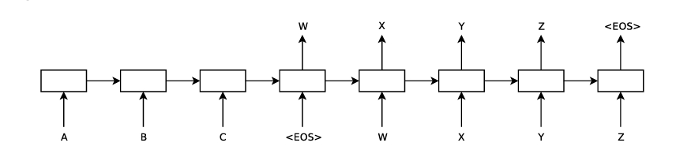

# Sequence to Sequence Learning with LSTMs

### Overview
The paper introduced a great method for machine translation using LSTM based neural networks that can translate input sequences (like English sentences) directly to output sequences (like Arabic sentences) without depending on traditional phrase based statistical translation models.

### The Idea
The core idea is to use two separate LSTM networks: an encoder and a decoder. The encoder reads the input sentence (in reverse order) and encodes it into a fixed-size vector that represents the entire sentence. This vector is then passed to the decoder which learns to generate the target sentence word-by-word.

One of the key insights from the paper is that reversing the input sentence actually helps the LSTM learn better, especially for long sentences. This trick brings words in the source and target sentences closer together in time, making it easier for the model to learn relationships between them.

### Training Details
The model was trained on 12 million English-French sentence pairs from the WMT'14 dataset. The LSTMs were deep—each had 4 layers with 1000 units per layer—and they used word embeddings of size 1000. Training was done using SGD with a learning rate schedule and gradient clipping to prevent exploding gradients. Sentences were grouped into batches of similar length to speed up training.

### Performance
The LSTM based model achieved a BLEU score of 34.8, which was better than the baseline phrase-based system score of 33.3. Even better, when the LSTM model was used to rescore the outputs of the baseline system, the BLEU score improved to 36.5, very close to the best reported result on the WMT'14 dataset.

The model handled long sentences well. This was largely due to the reversed input trick. Also, analysis showed that the LSTM learned to represent entire sentences in a meaningful way, capturing word order and even grammatical structure.

You can read the full paper [here on arXiv](https://arxiv.org/abs/1409.3215).
