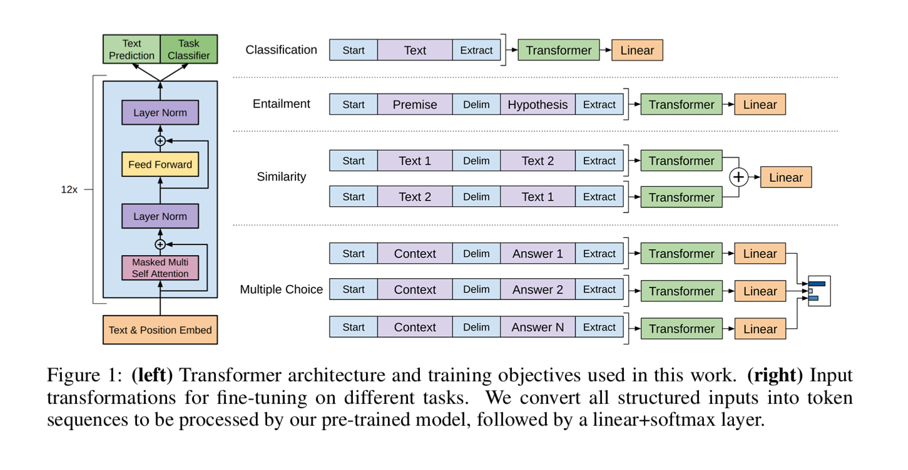
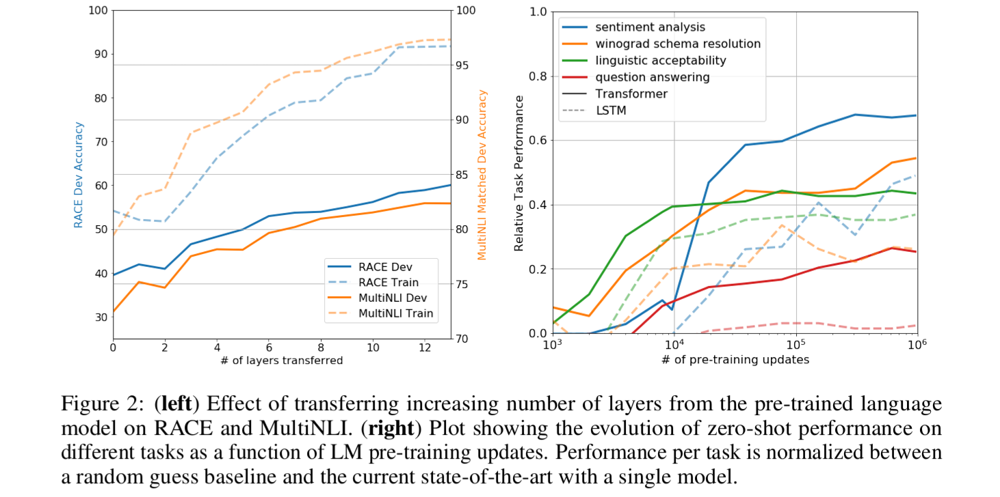

# Improving Language Understanding by Generative Pre-Training (GPT-1)

Today it is The model described in the paper "Improving Language Understanding by Generative Pre-Training" by OpenAI. The model leverages a two-stage training process to achieve strong performance across a variety of natural language understanding tasks.

---

## Overview

The approach consists of:

1. **Unsupervised Pre-Training**: Training a transformer-based language model on a large corpus of unlabeled text to learn general language representations. ([cdn.openai.com](https://cdn.openai.com/research-covers/language-unsupervised/language_understanding_paper.pdf))

2. **Supervised Fine-Tuning**: Adapting the pre-trained model to specific tasks using labeled datasets.

This method allows the model to transfer learned knowledge to various tasks with minimal task-specific adjustments.

---

## Model Architecture

The model utilizes a 12-layer decoder-only Transformer architecture, as introduced in "Attention is All You Need" by Vaswani et al. Key components include:

- **Masked Self-Attention**: Ensures that predictions for token \( i \) can depend only on tokens before \( i \).
- **Position-Wise Feed-Forward Networks**: Consists of two linear transformations with a ReLU activation in between.
- **Layer Normalization**: Applied to each sub-layer (attention and feed-forward) before the operation.
- **Residual Connections**: Around each sub-layer, followed by layer normalization.
- **Positional Encodings**: Added to the input embeddings to provide information about the relative or absolute position of tokens in the sequences.

---

## Training Objectives

### 1. Unsupervised Pre-Training

The model is trained to predict the next token in a sequence, maximizing the likelihood:

$$
L_1(U) = \sum_{i} \log P(u_i \mid u_{i-k}, \dots, u_{i-1}; \Theta)
$$

Where:  
$$
U = \{u_1, u_2, \dots, u_n\} \quad \text{is the sequence of tokens} \\
k \quad \text{is the size of the context window} \\
\Theta \quad \text{represents the parameters of the model}
$$

This objective allows the model to learn general language representations.

### 2. Supervised Fine-Tuning

For a labeled dataset 

$$
C = \{(x_1, y_1), \dots, (x_m, y_m)\}
$$

where \( x_i \) is a sequence of tokens and \( y_i \) is the label:

$$
L_2(C) = \sum_{(x, y)} \log P(y \mid x; \Theta)
$$

The model's output is passed through a softmax layer to predict the label.

### 3. Auxiliary Language Modeling Objective

An auxiliary language modeling objective is added during fine-tuning to improve generalization and accelerate convergence:

$$
L_3(C) = L_2(C) + \lambda \cdot L_1(C)
$$

Where:
- \( \lambda \) is a hyperparameter controlling the weight of the auxiliary objective.

This combined objective helps the model retain its generative capabilities while adapting to specific tasks.

---

## Fine-Tuning Details

- **Learning Rate**: 6.25e-5  
- **Batch Size**: 32  
- **Dropout Rate**: 0.1  
- **Epochs**: 3 (sufficient for most tasks)  
- **Learning Rate Decay**: Linear decay over 0.2% of training steps  

These settings are optimized to balance training efficiency and model performance.

---

## Results

The model achieves state-of-the-art results on several benchmarks:

- **GLUE Benchmark**: Achieves an average score of 72.8, surpassing previous bests.  
- **Natural Language Inference (NLI)**: Improves accuracy on datasets like MNLI, SciTail, and QNLI.  
- **Question Answering**: Outperforms previous models on the RACE dataset.  
- **Semantic Similarity**: Achieves high F1 scores on MRPC and STS-B.  
- **Text Classification**: Achieves 91.3% accuracy on SST-2.  

These results demonstrate the effectiveness of the generative pre-training approach across diverse tasks.

---

## Code Implementation

The code for training and fine-tuning the model is available at:

[https://github.com/openai/finetune-transformer-lm](https://github.com/openai/finetune-transformer-lm)

This repository provides scripts for training on various datasets and includes pre-trained model checkpoints.

---

## Further Reading

- [Original Paper (PDF)](https://cdn.openai.com/research-covers/language-unsupervised/language_understanding_paper.pdf)  
- [OpenAI Blog Post](https://openai.com/index/language-unsupervised/)  
- [Interactive Transformer Visualization](https://poloclub.github.io/transformer-explainer/)

---

## Conclusion

The Generative Pre-Training Transformer (GPT-1) demonstrates that large-scale unsupervised pre-training followed by supervised fine-tuning can achieve strong performance across a wide range of natural language understanding tasks. This approach reduces the need for large labeled datasets and allows for efficient transfer learning.
