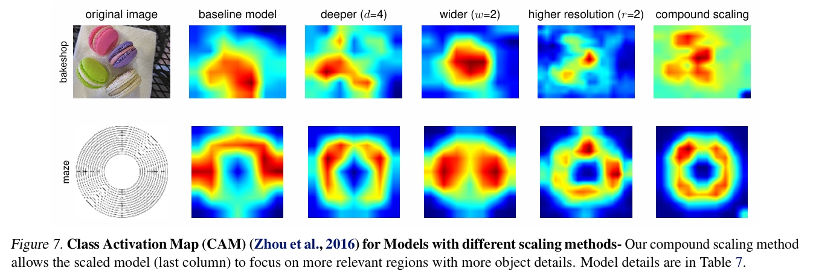

# EfficientNet: A Smarter Way to Scale CNNs

This paper presents a smart and simple idea to make Convolutional Neural Networks (CNNs) better. The result is a group of models that are not only more accurate but also smaller and faster than many big, popular models used before.

---

## What’s the Problem?

Before EfficientNet, if we wanted better results from CNNs, we just made them deeper (more layers) or wider (more channels). But doing this blindly caused big issues:
- The models became too large and slow
- They needed a lot of memory and computing power
- There was no clear rule on how to scale models properly

EfficientNet comes to solve this in a clean, organized way.

---

## About EfficientNet

EfficientNet introduces a new method called **compound scaling**. This technique scales depth (layers), width (channels), and input image size all together using a simple formula. That way, the model stays balanced and works more efficiently.

The starting point is a small but strong model called EfficientNet-B0 which was found using an automated search tool (Neural Architecture Search). From this model, other versions like B1 to B7 are created by scaling up each one getting a little bigger and better.

---

## Main Ideas Behind the Model

- **Compound Scaling**: Instead of making the network bigger in just one way, EfficientNet scales everything together — layers, width, and image size to keep the model balanced.

- **Neural Architecture Search (NAS)**: The base model, EfficientNet-B0, wasn’t built by hand. It was discovered using AutoML tools, which automatically search for good model structures.

- **Efficiency + Accuracy**: Even though EfficientNet is smaller than many previous models, it still beats them in accuracy. For example, EfficientNet-B7 performs better than a giant model like GPipe while using much less memory and computation.

---

## What Can You Learn from This Paper?

This paper teaches that:
- Making a model bigger isn’t always the best way to improve it.
- You can get better results by scaling all parts of the model in balance.
- A well-designed small model can be smarter than a large, heavy one.
- AutoML and Neural Architecture Search can help create great models automatically.
- Good design can beat brute-force solutions.

---

## Paper Info

- **Title**: EfficientNet: Rethinking Model Scaling for Convolutional Neural Networks  
- **Link**: [arXiv:1905.11946](https://arxiv.org/abs/1905.11946)
