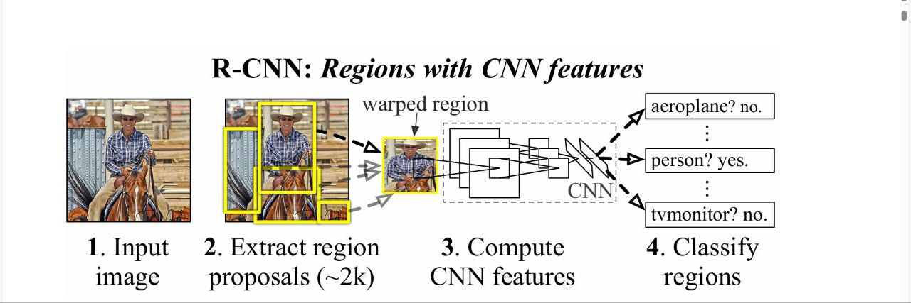

# R-CNN: Rich Feature Hierarchies for Accurate Object Detection and Semantic Segmentation

## Abstract

In recent years, object detection performance on popular datasets like PASCAL VOC stopped their improvements. Prior methods typically involved complex ensembles of hand crafted features and contextual models, resulting in limited progress. This paper introduces *R-CNN (Regions with CNN features)*, a more effective and scalable approach that significantly boosts detection accuracy. The core idea is to use region proposals to identify candidate object regions in an image and then apply deep convolutional neural network (CNN) features to classify those regions. The authors show that pretraining a CNN on a large dataset like ImageNet and then fine-tuning it for the object detection task yields a substantial performance improvement. This pipeline achieves a 30% increase in mean average precision (mAP) compared to previous methods, setting new benchmarks in the field.

## Introduction

Traditional object detection systems relied on features such as SIFT and HOG combined with sliding window classifiers. However progress stagnated due to the limitations of these handcrafted features. The emergence of deep learning particularly CNNs offered a fresh perspective. 
This work introduces a framework that uses region proposal techniques with deep learning. Rather than scanning the image with a sliding window, the system first generates region proposals using selective search. Each region is then warped and passed through a CNN to extract features. These features are classified using linear SVMs and bounding box regression is applied to improve localization. This approach bridges the gap between traditional detection pipelines and modern deep learning architectures.

## Method Overview

The RCNN pipeline is straightforward yet powerful. First, an input image is processed to generate ~2k region proposals using a technique called selective search. Each of these proposals is resized to a fixed size of 227x227 pixels and passed through a CNN to extract a 4096 dimensional feature vector from one of the fully connected layers. These feature vectors are then classified using linear SVMs trained for each object class. Finally, a bounding box regressor is used to predict the coordinates of the detected objects.

By decoupling the region proposal step from the feature learning and classification stages, the system gains flexibility and efficiency. The CNN operates on fixed size inputs, allowing pretrained networks to be reused. The selective search algorithm ensures that only the most promising regions are evaluated, reducing the computational burden.

## Architecture Details

The architecture combines several key components. Region proposals are generated using selective search which merges superpixels based on color, texture, size, and shape compatibility. 

The CNN used is the AlexNet model by Krizhevsky(2012), implemented in Caffe. Each region is resized and passed through the CNN, with features extracted from the fc7 layer. These features are then input to class-specific SVMs. Regions with an Intersection over Union (IoU) above 0.5 with ground truth boxes are treated as positives, while those below 0.3 are negatives. To train the SVMs efficiently, hard negative mining is employed.

To improve localization, the system includes a bounding-box regressor trained on the same CNN features. This regressor learns to predict adjustments to the coordinates of each proposal, resulting in tighter and more accurate bounding boxes.

## Training Strategy

The training process involves three key stages. First, the CNN is pretrained on the ImageNet classification task. This provides a strong initialization for the network. Next, the network is fine-tuned on region proposals extracted from the detection dataset, such as PASCAL VOC. The output layer is modified to include one node per object class, plus one for background. The network is trained using stochastic gradient descent with a learning rate of 0.001 and mini-batches composed of both positive and negative examples.

Once the CNN is fine-tuned, features are extracted for all proposals in the training set. These features are used to train a set of one-vs-all linear SVMs. To further improve performance, hard negative mining is used to iteratively add difficult background examples to the training set. Finally, the bounding-box regressor is trained using the CNN features and the ground truth box offsets.

## Results

On the PASCAL VOC 2010 dataset, R-CNN achieved a remarkable 53.7% mAP, a major improvement over previous state-of-the-art systems which typically scored around 33–35%. On the ILSVRC2013 detection challenge, R-CNN scored 31.4% mAP, outperforming OverFeat, which achieved 24.3%. These results demonstrate the effectiveness of combining region proposals with deep CNN features.

In terms of runtime, processing a single image takes about 13 seconds on a GPU and 53 seconds on a CPU. While this may seem slow, the system is still practical due to its high accuracy and modular design. Furthermore, later versions like Fast R-CNN and Faster R-CNN have significantly reduced the inference time.

## Visualizations

One of the interesting aspects of CNNs is their ability to learn interpretable features. Visualizations of the pool5 layer show that the network learns to detect textures, materials, and object parts such as faces or text. These visualizations provide insight into what the network is focusing on and help to understand how the model distinguishes between classes.

### Ablation Studies

Several experiments were conducted to understand the contributions of each component. Without fine-tuning, features from intermediate layers like pool5 still provided reasonable performance. However, fine-tuning significantly boosted accuracy, with the majority of gains coming from the fc6 and fc7 layers.

The authors also compared different CNN architectures. Using the deeper VGG-16 network (referred to as O-Net) instead of AlexNet (T-Net) led to even better results, with mAP improving from 58.5% to 66.0%. The trade-off was increased computation time, with VGG-16 being about seven times slower.

### Error Analysis

An analysis of detection errors revealed that the main source of error was inaccurate localization. Bounding box regression helped address this issue. Fine-tuning also made the model more robust to occlusions, truncations, and different viewpoints. Overall, the system became more reliable across a variety of challenging scenarios.

### Semantic Segmentation Extension

RCNN was also extended to the task of semantic segmentation. Using CPMC to generate segmentation proposals, features were extracted from full regions, foreground-only regions, and a combination of both. The best performance was achieved by combining full and foreground features, resulting in a mean accuracy of 47.9% on the PASCAL VOC 2011 segmentation benchmark, outperforming the previous best approach, O2P.

